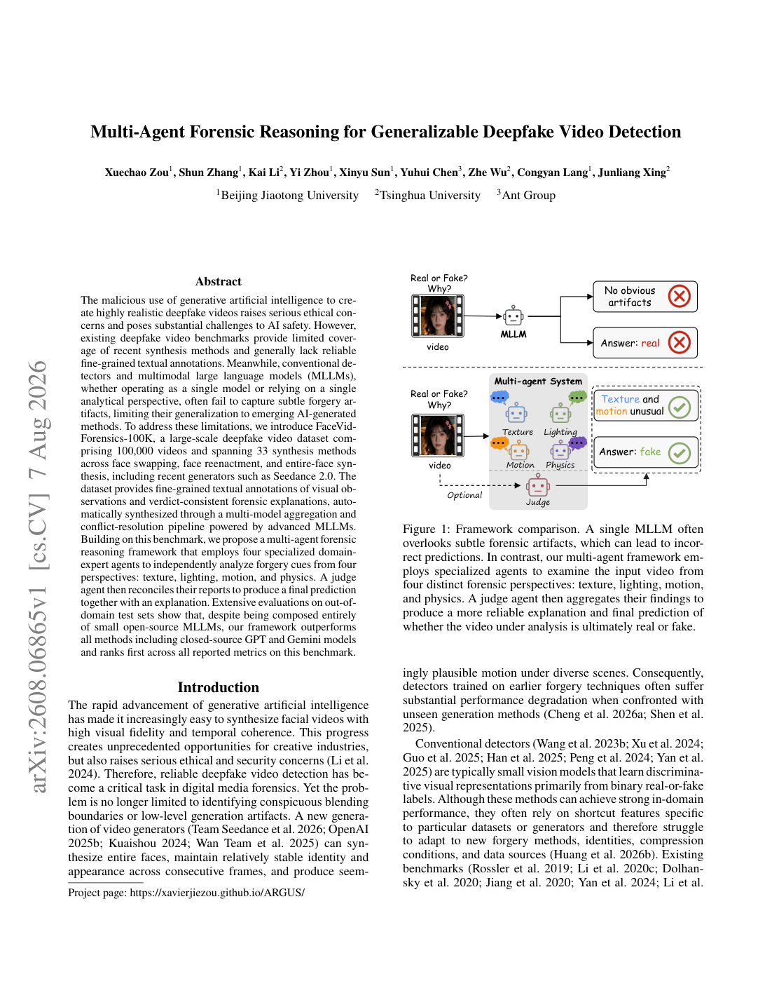
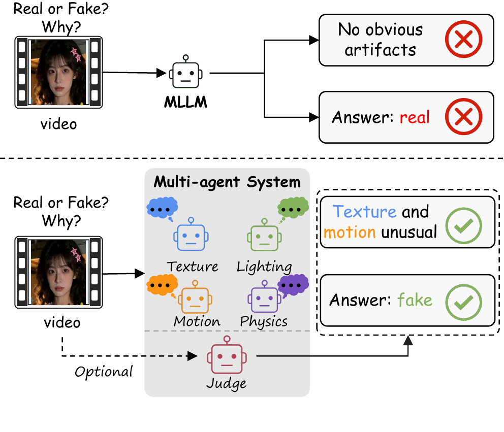
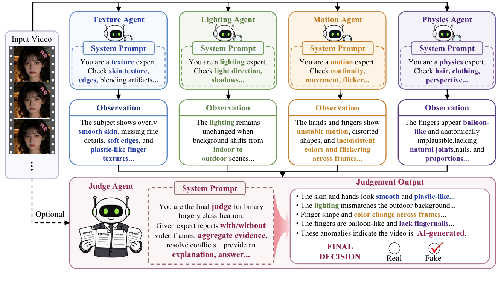
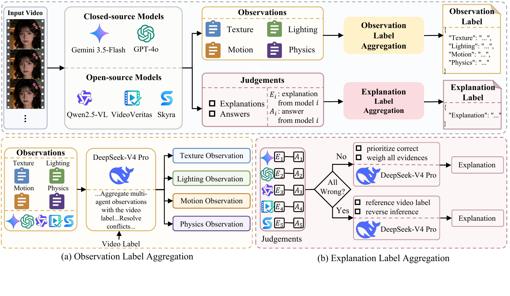
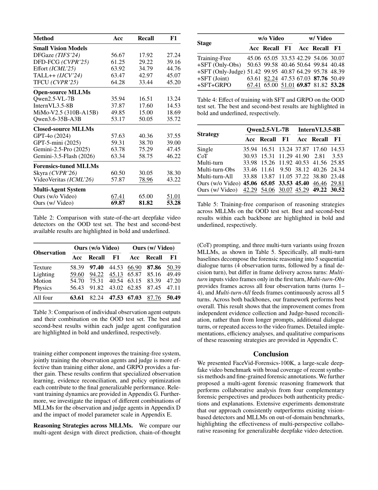
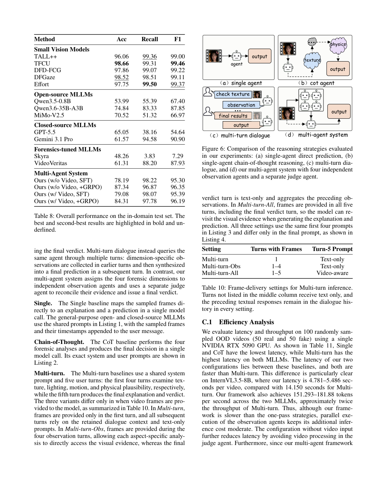

# 四个观察者，一个裁判：ARGUS 如何让 AI 生成视频鉴伪更可解释

一段视频被判定为 AI 生成之后，真正值得追问的往往不是一个真假标签，而是模型究竟看到了什么。面对越来越逼真的生成视频，单一模型很容易被某个显眼线索带偏，也难以说明结论来自哪些画面证据。来自研究团队的 ARGUS 将鉴伪过程拆成“观察”和“判断”两个阶段：四个专门的观察智能体分别寻找纹理、光照、运动和物理规律上的异常，再由一个裁判智能体汇总证据，给出最终判断与解释。

## 论文与项目

**论文：** Multi-Agent Forensic Reasoning for Generalizable Deepfake Video Detection（arXiv:2608.06865v1）  
**项目主页：** https://xavierjiezou.github.io/ARGUS/  
**作者：** Xuechao Zou、Shun Zhang、Kai Li、Yi Zhou、Xinyu Sun、Yuhui Chen、Zhe Wu、Congyan Lang、Junliang Xing

项目页同时发布了 FaceVid-Forensics-100K 数据集和 ARGUS 框架。本文依据项目页与论文 v1 整理，论文目前按预印本信息介绍，未在文中添加未经核实的录用或首发信息。

## 从“看结果”到“找证据”

传统鉴伪器通常直接把视频映射为 Real 或 Fake。这样的流程在测试集上可以给出分数，却不一定能回答：异常来自皮肤纹理、光照关系，还是跨帧运动？如果多个模型沿着同一个错误直觉连续推理，后续步骤只会把最初的误判包装得更完整。

ARGUS 的关键设计是让证据收集彼此独立。四个观察智能体各自负责一个维度，并且在观察阶段不输出最终真假结论：

- **纹理观察者**关注皮肤、头发、背景等区域的细节、平滑度与融合痕迹；
- **光照观察者**检查高光、阴影和不同物体之间的照明是否一致；
- **运动观察者**比较面部、头发、背景及其他物体在时间上的变化；
- **物理观察者**寻找人体生理、几何关系和物体运动规律上的不协调。

裁判智能体接收这些报告，并可结合抽取的视频帧，对相互印证或彼此冲突的证据进行权衡，最后输出二元预测和一段与观察结果对应的取证解释。这样一来，系统的“看到了什么”和“因此如何判断”被明确分开。

## FaceVid-Forensics-100K：覆盖更多生成来源

为了训练和评估这种证据驱动的鉴伪流程，作者构建了 FaceVid-Forensics-100K。数据集包含 100,000 段视频，其中 21,075 段为真实视频、78,925 段为伪造视频，覆盖人脸替换、人脸重演和整脸生成等任务，并纳入包括 Seedance 2.0 在内的近期生成方法，总计涉及 33 种合成方法。

数据集的重点不只是扩大视频数量，还包括更细粒度的文本监督。作者使用多模型聚合与冲突消解流程，为视频生成视觉观察和与最终 verdict 一致的取证解释。

评测协议进一步区分训练中见过的来源与未见过的身份、生成器，专门考察模型面对新型生成方法时的泛化能力。

## 训练：先学会观察，再学习裁判

ARGUS 的训练流程包含监督微调（SFT）和群体相对策略优化（GRPO）两个阶段。监督微调让不同角色学习各自的输入、输出和证据组织方式；在此基础上，GRPO 用最终判断与解释的一致性等信号继续优化裁判和整体推理流程。

这种角色分工带来两个直接好处。第一，观察者不会因为急于给出真假标签而忽略局部线索；第二，裁判面对冲突报告时可以比较证据，而不是把某一个醒目的异常直接当成结论。项目页给出的示例中，四个观察者能够分别指出皮肤过度平滑、头发缺少逐根运动、前景与背景运动不匹配，以及面部微表情和生理运动缺失等线索，裁判再将它们组织成连贯解释。

## 面向未见生成器的评测

作者在域外（OOD）测试集上评估 ARGUS，测试集包含 7,636 段来自 20 个训练阶段未使用生成器的视频。项目页报告显示，ARGUS 在所报告的全部指标上排名第一，并超过了包括闭源 GPT 与 Gemini 在内的对比方法。这里的结论适用于论文所定义的数据划分、模型配置和指标；它不等同于对所有现实场景或所有新生成器的普遍保证。

主实验表同时报告 Accuracy、Recall 和 F1。相比只在一个指标上比较，三项指标一起看更能体现模型在不同错误类型之间的取舍。

消融结果显示，观察者分工与裁判聚合是整体性能的重要组成部分；去掉独立观察或改变聚合方式，都会影响最终判断。

更值得关注的是模型规模与系统设计之间的关系：ARGUS 完全由小型开源多模态语言模型组成，却通过独立观察和裁判聚合获得了更稳定的证据覆盖。结果提示，提升视频鉴伪能力不只依赖更大的单模型，也可以从分析视角的组织方式入手。

## 结语：把结论变成可检查的判断

深度伪造视频会继续变化，单一线索也会继续失效。ARGUS 的贡献在于提供一种可检查的分析流程：先把视觉证据拆到不同观察维度，再让裁判处理证据之间的支持与冲突，同时用覆盖多种生成来源的数据集检验泛化能力。对于需要解释的鉴伪系统，这种“证据先行、判断后置”的设计或许比单纯输出一个更高分数更有价值。

**资源链接**  
论文： https://arxiv.org/html/2608.06865v1  
项目与数据集： https://xavierjiezou.github.io/ARGUS/
