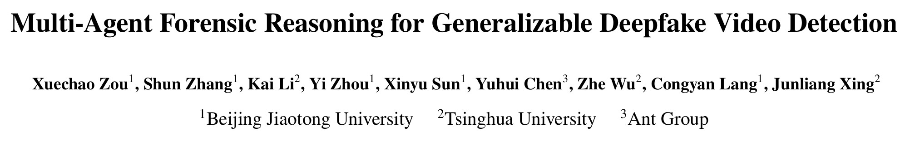
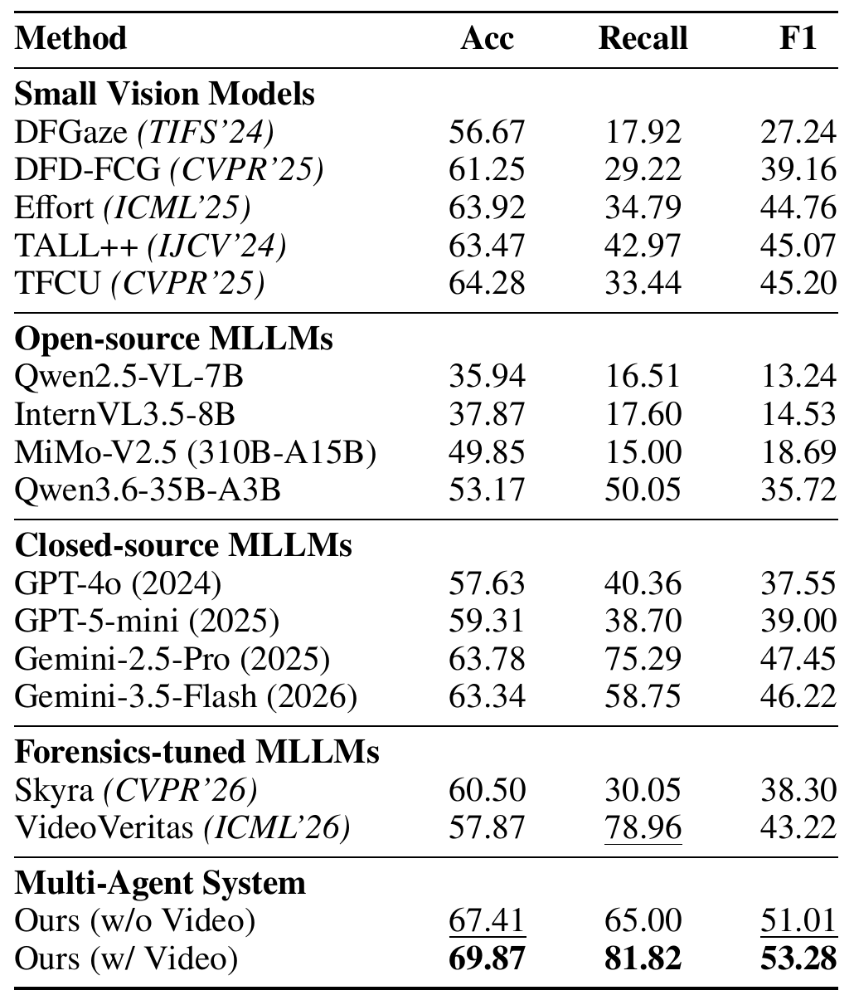
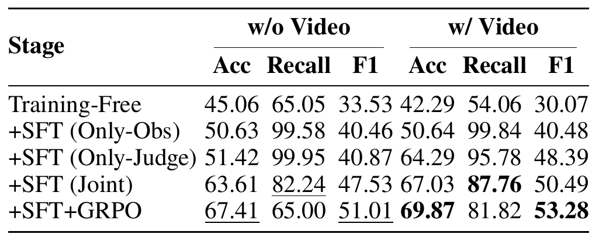
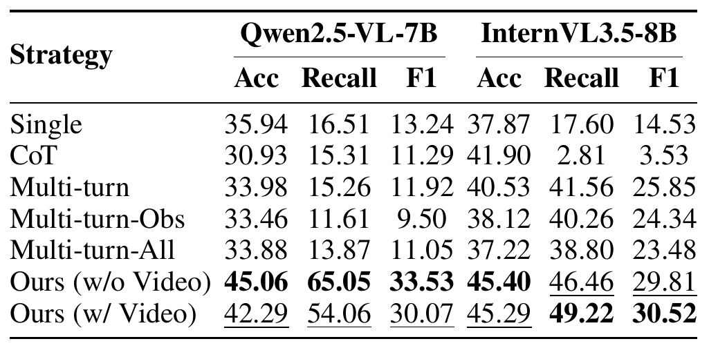

# 真假视频难分？北交大等提出 ARGUS，多智能体协作追查伪造证据

看起来毫无破绽的视频，真的是实拍吗？当鉴伪模型给出“AI 生成”的判断时，我们还希望知道：它依据了哪些画面线索，遇到未见过的生成器还能否判断准确？

北京交通大学、清华大学与蚂蚁集团的研究者提出 ARGUS，将多智能体协作引入视频鉴伪。观察智能体从不同角度寻找证据，裁判智能体再综合判断，让检测过程留下可检查的中间观察。在论文报告的域外测试中，ARGUS 的 F1 达到 53.28%，比同表中的 Gemini-2.5-Pro 高 5.83 个百分点。

## 论文与项目

**论文：** Multi-Agent Forensic Reasoning for Generalizable Deepfake Video Detection（arXiv:2608.06865v1）

**论文地址：** https://arxiv.org/abs/2608.06865v1

**项目主页：** https://xavierjiezou.github.io/ARGUS/

**作者：** Xuechao Zou、Shun Zhang、Kai Li、Yi Zhou、Xinyu Sun、Yuhui Chen、Zhe Wu、Congyan Lang、Junliang Xing

这项工作同时提出 FaceVid-Forensics-100K 数据集，为多视角观察与取证解释提供训练和评测材料。论文当前公开版本为 arXiv 预印本。

## 从“看结果”到“找证据”

传统鉴伪器通常直接把视频映射为 Real 或 Fake。这样的流程在测试集上可以给出分数，却不一定能回答：异常来自皮肤纹理、光照关系，还是跨帧运动？如果多个模型沿着同一个错误直觉连续推理，后续步骤只会把最初的误判包装得更完整。

ARGUS 的关键设计是让证据收集彼此独立。观察智能体分别负责不同维度，在观察阶段不输出最终真假结论：

- **纹理观察者**关注皮肤、头发、背景等区域的细节、平滑度与融合痕迹；
- **光照观察者**检查高光、阴影和不同物体之间的照明是否一致；
- **运动观察者**比较面部、头发、背景及其他物体在时间上的变化；
- **物理观察者**寻找人体生理、几何关系和物体运动规律上的不协调。

裁判智能体接收这些报告，并可结合抽取的视频帧，对相互印证或彼此冲突的证据进行权衡，最后输出二元预测和一段与观察结果对应的取证解释。这样一来，系统的“看到了什么”和“因此如何判断”被明确分开。

## FaceVid-Forensics-100K：覆盖更多生成来源

为了训练和评估这种证据驱动的鉴伪流程，作者构建了 FaceVid-Forensics-100K。数据集包含 100,000 段视频，其中 21,075 段为真实视频、78,925 段为伪造视频，覆盖人脸替换、人脸重演和整脸生成等任务，并纳入包括 Seedance 2.0 在内的近期生成方法，总计涉及 33 种合成方法。

数据集的重点不只是扩大视频数量，还包括更细粒度的文本监督。作者使用多模型聚合与冲突消解流程，为视频生成视觉观察和与最终 verdict 一致的取证解释。

评测协议进一步区分训练中见过的来源与未见过的身份、生成器，专门考察模型面对新型生成方法时的泛化能力。

## 训练：先学会观察，再学习裁判

ARGUS 以 Qwen2.5-VL-7B 为基础模型，训练包含监督微调（SFT）和群体相对策略优化（GRPO）两个阶段。SFT 分别训练观察智能体与裁判，让它们学习各自的观察和判断任务。随后冻结观察智能体，仅用 GRPO 优化裁判：奖励依据最终真假判断是否正确，同时通过 KL 约束限制相对 SFT 策略的偏移。这里优化的是分类决策，不能直接等同于每条解释都更准确。

这种角色分工旨在减少观察阶段过早下结论的影响，也让裁判能够比较相互冲突的报告。观察内容仍可能遗漏线索或包含错误，证据必须结合原视频核查。

## 面向未见生成器的评测

作者在域外（OOD）测试集上评估 ARGUS：共 7,636 段视频，其中 5,716 段真实视频、1,920 段伪造视频；伪造视频来自 20 个训练阶段未使用的生成器。评测比较了小型视觉模型、通用开源和闭源多模态模型，以及经过鉴伪任务训练的多模态模型。

当裁判同时接收观察报告与视频帧时，ARGUS 的 Accuracy、Recall、F1 分别为 69.87%、81.82%、53.28%，均为这张主表中的最高值。仅接收观察报告时，F1 为 51.01%；加入视频帧后提高 2.27 个百分点，说明原始视觉信息能补充文本观察。真实与伪造样本数量并不均衡，需要结合三项指标理解结果，不能把单项得分推广为所有场景下的识别能力。

## 训练与协作分别带来了什么

在裁判可接收视频帧的设置下，未经训练的系统 F1 为 30.07%；同时对观察者和裁判进行 SFT 后达到 50.49%，进一步应用 GRPO 后为 53.28%。不过，GRPO 后 Recall 从 87.76% 降至 81.82%，并非每项指标都单调提高。训练消融支持联合训练与裁判优化的作用，也展示了不同指标之间的取舍。

推理策略对比使用冻结模型，以减少训练带来的干扰。在 Qwen2.5-VL-7B 上，直接判断的 F1 为 13.24%，多智能体文本裁判设置为 33.53%；在 InternVL3.5-8B 上，相应的直接判断为 14.53%，多智能体视频裁判设置为 30.52%。同表还比较了思维链和多轮对话，结果支持独立观察与证据汇总的价值。两种骨干的最佳裁判输入并不相同，因此不能简单概括为“多看视频帧就一定更好”。

## 结语：把结论变成可检查的判断

深度伪造视频会继续变化，单一线索也会继续失效。ARGUS 的贡献在于提供一种可检查的分析流程：先把视觉证据拆到不同观察维度，再让裁判处理证据之间的支持与冲突，同时用覆盖多种生成来源的数据集检验泛化能力。对于需要解释的鉴伪系统，这种“证据先行、判断后置”的设计或许比单纯输出一个更高分数更有价值。

**资源链接**

论文： https://arxiv.org/abs/2608.06865v1

项目： https://xavierjiezou.github.io/ARGUS/

代码： https://github.com/XavierJiezou/ARGUS

模型： https://huggingface.co/XavierJiezou/argus-models

数据： https://huggingface.co/datasets/XavierJiezou/argus-datasets
